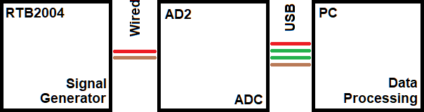
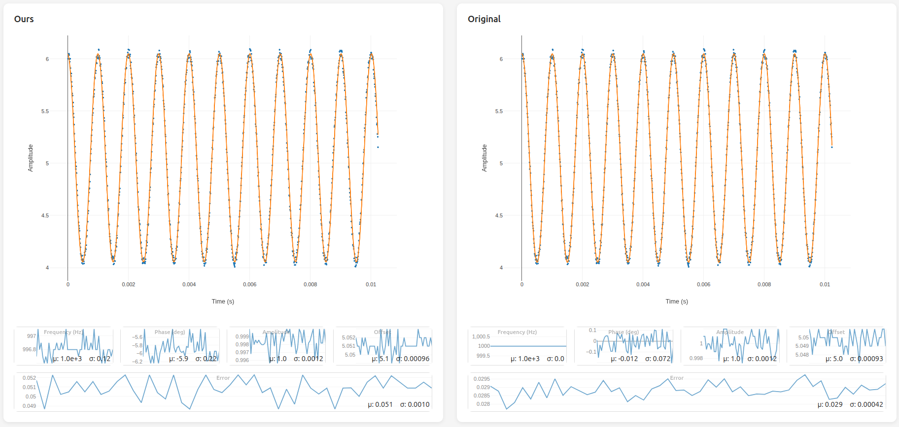
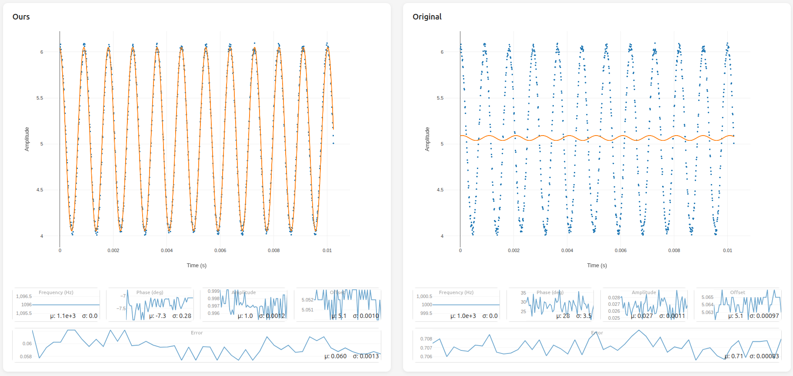
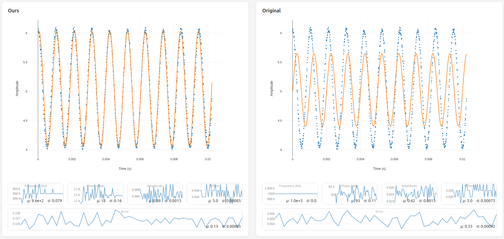
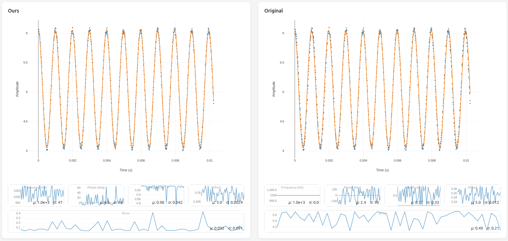

# Project_1_DSP

Non-MATLAB-based approach to estimating `amplitude`, `frequency`, `phase` and `offset` parameters of a sinusoidal signal

| CATEGORY  | ATTRIBUTION                          |
| --------- | ------------------------------------ |
| Authors   | Wesley Ricaporte , Nicholas T.       |
| Class     | ECEN4632 - Digital Signal Processing |
| Professor | Dr. Talles Santos                    |

---

# 1. Introduction

Pure sinusoidal functions can be described using exactly four
parameters: amplitude (_A_), frequency (_f_), phase shift (_φ_), and
offset (_C_), as in equation 1.1 below:

| $x(t) = Acos(2\pi ft + \phi) + C$ | 1.1 |
| --------------------------------- | --- |

Generating signals is clearly trivialized by this formula. However
reversing the process–estimating these parameters from a set of
points–is far more difficult and far less clean. This paper introduces a
novel method to estimate these parameters by adjusting a preexisting
method.

# 2. Original QAM Method

## 2.1 Overview

Quadrature Amplitude Modulation, or QAM, is a method that uses
orthogonal sinusoidal waves to estimate the amplitude, phase shift, and
DC offset of some original sinusoidal signal. This method assumes that
all parameters of the original sinusoidal signal are constant across
sampled period. Note that the desired frequency of the parameterized
signal must be provided for this method to function.

## 2.2 Algorithm

This method is fairly simple to implement. For input signal row vector
_X_, consisting of _n_ samples sampled at a rate of _f<sub>s</sub>_:

1.  Compute the _Error_ matrix (_E_)

2.  Compute the pseudo-inverse of _E_, producing $E_p$

3.  Compute the product $XE_{p}$, producing the column vector _S_

4.  Extract the relevant parameters from _S_, yielding _A_, _φ_, and _C_

The details of this algorithm are expanded on in the subsections below.

### Error Matrix

_E_ is a matrix of dimensions (_n_ x 3), produced by concatenating three
separate column vectors. Equations _2.1, 2.2, 2.3_ respectively describe
columns 1, 2, 3 for each row _t<sub>n</sub>_,
$t_{n} \in \{ 0,\ 1,\ 2,\ \ldots,\ n - 1\}$_,_

| $(2\pi f*{s}t*{n})$    | 2.1 |
| ---------------------- | --: |
| $cos(2\pi f_{s}t_{n})$ | 2.2 |
| 1                      | 2.3 |

Note that column 3 consists purely of the constant value 1 and does
_not_ vary with the row.

### 2.2.2 Pseudo-Inverse

Only square matrices with non-zero determinants are invertible. The QAM
method relies on obtaining the inverse of the error matrix, which is
clearly not guaranteed to be square. As such, we instead compute the
_Moore-Penrose_ inverse, as shown in equation _2.4_ (Weisstein, 2026),
for matrix _A_ and transposed matrix _A’_.

| $(A'A)^{- 1}A'$ | 2.4 |
| --------------- | --- |

Matrix _E<sub>p</sub>_ is thus calculated using (2.4), as
$E_{p} = (E'E)^{- 1}E'$.

### Parameter Vector S

The _S_ vector is computed by treating the original signal _X_ as a (1 x
_n_) matrix, then multiplying by the (_n_ x 3) _E<sub>p</sub>_ matrix,
creating the final (1 x 3) matrix _S_ which can be interpreted as a
3-dimensional vector.

### 2.2.4 Parameter Extraction

The final 3-dimensional vector _S_ can be interpreted as a row vector
with the following entries: $\lbrack\ \alpha,\ \beta,\ C\ \rbrack$.
The parameters _α_ and _β_ can be used directly in equation _2.5_ to
describe the sinusoid. To fit (_1.1_), these parameters can be
transformed into _A_ and _φ_ using equations _2.6_ and _2.7_ (Notice
that these equations effectively transform from cartesian to polar
values).

| $\alpha sin(2\pi ft) + \beta\cos(2\pi ft) + C$ | 2.5 |
| ---------------------------------------------- | --: |
| $A = \sqrt{\alpha^{2} + \beta^{2}}$            | 2.6 |
| $\phi = \tan^{- 1}(\frac{\alpha}{\beta})$      | 2.7 |

## 2.3 Comments

For a given known constant frequency _f_, this equation gives the best
possible parameters _A, φ, C_ possible for fitting the original
equation, minimizing error. This algorithm’s main disadvantage is its
reliance on an already-known frequency _f_, a hole that the proposed
method aims to fill.

# 3. Experimental FFT Method

## 3.1 Overview

Our technique augments the original QAM method through adding _automatic
frequency detection_ using a Fast Fourier Transform (FFT)-based
approach. This detected frequency is then used as the _f_ in the QAM
method, which is then run unmodified.

## 3.2 Algorithm

Our experimental method processes the sampled signal in a fixed
pipeline; first computing the estimated frequency, then estimating the
amplitude, phase, and offset using the proven QAM method. For input
signal row vector _X_, consisting of _n_ samples sampled at a rate of
$f_s$:

1.  FFT Dominant Frequency Detection
2.  Band-Pass Filtering
3.  Zero-Crossing Detection
4.  Zero-Crossing Distancing
5.  Frequency Aggregation
6.  QAM

The details of this algorithm are expanded on in the subsections below.

### 3.2.1 FFT Dominant Frequency Detection

This step seeds the rest of the algorithm with an initial (imprecise)
frequency guess. This is achieved through the following procedure:

1.  Transform input signal _X_ into the frequency domain using the Fast
    Fourier Transform (FFT), producing _X<sub>s</sub>_

2.  Find the sample within the first half[^1] of _X<sub>s</sub>_ with
    the greatest magnitude[^2]. This represents the “dominant” frequency
    component. Call the sample index _i_,
    $i \in \left\{ 0,\ 1,\ \ldots,\ n - 1 \right\}$

3.  Compute the initial guess _f<sub>i</sub>_ using equation (3.1)

| $f_{0} = i\left( \frac{f_{s}}{n} \right)$ | 3.1 |
| ----------------------------------------- | --- |

_Note that this equation is a simple linear interpolation, mapping from_
$\{ 0,\ 1,\ \ldots,\ n\}$ _to_ $0,\ 1,\ \ldots,\ f_{s}$.

Notice that this algorithm _intentionally_ ignores any and all
information stored in all _X<sub>s</sub>_ buckets besides the largest.

### 3.2.2 Band-Pass Filtering

The initial guess, _f<sub>i</sub>_ is used to generate a filtered signal
_X<sub>f</sub>_. This computation is performed via the following
procedure:

1.  Compute a window _W_ around _f<sub>i</sub>_, such that the total
    width of the window takes up nine frequency buckets in
    _X<sub>s</sub>_

2.  Apply _W_ to _X<sub>s</sub>_, such that all samples within the
    window are untouched, and all samples outside the window are reduced
    to zero

3.  Compute the _Inverse_ Fast Fourier Transform (IFFT) of
    _X<sub>s</sub>_ to produce _X<sub>f</sub>_

The end result of this process is the clean time-domain signal
_X<sub>f</sub>_, representing _X_ after being run through an ideal
band-pass filter to largely remove high-frequency noise and
low-frequency undulations.

### 3.2.3 Zero-Crossing Detection

This step creates a list _Z_, $\left\| Z \right\| \leq \frac{n}{2}$,
where each entry $Z\lbrack i\rbrack$ represents some unique point
$X_{f}\lbrack k\rbrack \in X_{f}$ where each $Z[i]$ represents some
unique $X_f[i]$ which satisfies equation (3.2).

| $X*{f}\lbrack k\rbrack \leq 0 \land X*{f}\lbrack k + 1\rbrack > 0$ | 3.2 |
| ------------------------------------------------------------------ | --- |

The value stored in $Z[i]$ is the approximated zero-crossing location
using linear interpolation between points $X_f[k]$,
$X_f[k + 1]$. Note that the values in $Z[i]$ are stored as
strictly increasing scalars, for ease of future processing.

### 3.2.4 Zero-Crossing Distancing

From $Z$, compute $Z_d$, where $Z_d[i]$ represents
the distance between subsequent zero crossings, using equation (3.3).
Notice that $\left\| Z_{d} \right\| = \left\| Z \right\| - 1$. We
assume there are sufficiently many samples _X<sub>f</sub>_ such that
$\left\| Z \right\| \geq 2$.

| $Z_{d}\lbrack i\rbrack = Z\lbrack i + 1\rbrack - Z\lbrack i\rbrack$ | 3.3 |
| ------------------------------------------------------------------- | --- |

### 3.2.5 Frequency Aggregation

This step exists to aggregate the list of distances _Z<sub>d</sub>_ into
a single scalar value, which can then be treated as the dominant
frequency of _X_. This is achieved through simply averaging all values
in _Z<sub>d</sub>,_ as is shown in equation (3.4), to yield $T_z$.

| T*{Z} = $\frac{\sum*{}^{}Z*{d}}{\left\| Z*{d} \right\|}$ | 3.4 |
| -------------------------------------------------------- | --- |

_T<sub>z</sub>_ represents the period between upward zero crossings. As
each cycle of the signal represented by _X contains exactly one_ upward
zero crossing, _T<sub>z</sub> = T_, the period of the signal. It is
trivial to show then that the frequency _f_ can be computed through
equation (3.5).

| $f = \frac{1}{T_{Z}}$ | 3.5 |
| --------------------- | --- |

### 3.2.6 QAM

The computed frequency _f_, along with the original signal _X_, are
plugged into the QAM method previously described in section 2, yielding
the estimated A, _φ_, and _C_.

# 4. Experimental Setup

This section describes the methods used to compare the proposed
FFT-based approach with the original (control) QAM approach.

These tests were performed using real signal generators and ADCs, to
accurately capture real-world noise.

## 4.1 Materials

- Analog Discovery 2 (AD2)
- Rohde & Schwarz RTB2004

## 4.2 Electrical Configuration



_Figure 4.1a: The electrical setup used to generate the results shown in
section 5_

The signal generator of the RTB2004 was attached to analog channel 1 of
the AD2. The AD2 was then connected to a computer running _Waveforms_,
sending the signal data to our processing and visualization code.

## 4.3 Procedure

To test the proposed FFT-based approach against the original QAM
approach, multiple signal frequencies with various amounts of noise were
tested. Between tests, no changes were made to _any_ code[^3]. The
samples listed in _Table 4.3a_ were tested. The original QAM approach
was run with an expectation of 1.0kH.

_Table 4.3a: The sampled signals tested against, as generated by the
RTB2004_

<table style="width:100%;">
<colgroup>
<col style="width: 26%" />
<col style="width: 26%" />
<col style="width: 22%" />
<col style="width: 24%" />
</colgroup>
<thead>
<tr>
<th><strong>Frequency</strong></th>
<th><strong>Amplitude (V<sub>p</sub>)</strong></th>
<th><strong>DC Offset (V)</strong></th>
<th><strong>Noise (V<sub>p</sub>)</strong></th>
</tr>
</thead>
<tbody>
<tr>
<td>1.0 kHz</td>
<td>1</td>
<td>4</td>
<td>0.1</td>
</tr>
<tr>
<td>1.1 kHz</td>
<td>1</td>
<td>4</td>
<td>0.1</td>
</tr>
<tr>
<td>900 Hz</td>
<td>1</td>
<td>4</td>
<td>0.1</td>
</tr>
<tr>
<td><p>0.8 kHz – 1.2 kHz</p>
<p><em>SWEEP</em></p></td>
<td>1</td>
<td>4</td>
<td>0.1</td>
</tr>
</tbody>
</table>

The results from these tests are available in _Section 5: Results_.

# 5. Results



_Figure 5.1: Final iteration results for a 1kHz sinusoidal input with 10% added
noise, showing the estimated and original signals, along with the mean
($\mu$) and standard deviation ($\sigma$) for frequency,
phase, amplitude, offset, and error._

_Table 5.1: Error comparison between the original and final algorithms
for a 1 kHz sinusoidal input with 10% added noise._

| **Algorithm**      | **Mean Error (**$\mathbf{\mu\ }`$**)** | **Standard Deviation (**$`\mathbf{\sigma\ }$**)** |
| ------------------ | -------------------------------------- | ------------------------------------------------- |
| Original Algorithm | 0.029                                  | 0.00042                                           |
| Final Algorithm    | 0.051                                  | 0.0010                                            |



_Figure 5.2: Final iteration results for a 1.1kHz sinusoidal input with 10%
added noise, showing the estimated and original signals, along with the
mean ($\mu$) and standard deviation ($\sigma$) for frequency,
phase, amplitude, offset, and error._

_Table 5.2: Error comparison between the original and final algorithms
for a 1.1 kHz sinusoidal input with 10% added noise._

| Algorithm          | Mean Error ($\mu$) | Standard Deviation ($\sigma$) |
| ------------------ | ------------------ | ----------------------------- |
| Original Algorithm | 0.71               | 0.00093                       |
| Final Algorithm    | 0.060              | 0.0013                        |



_Figure 5.3: Final iteration results for a 900 Hz sinusoidal input with 10%
added noise, showing the estimated and original signals, along with the
mean ($\mu$) and standard deviation ($\sigma$) for frequency,
phase, amplitude, offset, and error._

_Table 5.3: Error comparison between the original and final algorithms
for a 900 Hz sinusoidal input with 10% added noise._

| Algorithm          | Mean Error ($\mu$) | Standard Deviation ($\sigma$) |
| ------------------ | ------------------ | ----------------------------- |
| Original Algorithm | 0.55               | 0.00092                       |
| Final Algorithm    | 0.13               | 0.00085                       |



_Figure 5.4: Final iteration results for a 0.8 kHz to 1.2 kHz frequency sweep
with 10% added noise, showing the estimated and original signals, along
with the mean ($\mu$) and standard deviation ($\sigma$) for
frequency, phase, amplitude, offset, and error._

_Table 5.4: Error comparison between the original and final algorithms
for a_ 0.8 kHz to 1.2 kHz frequency sweep _with 10% added noise._

| Algorithm          | Mean Error ($\mu$) | Standard Deviation ($\sigma$) |
| ------------------ | ------------------ | ----------------------------- |
| Original Algorithm | 0.49               | 0.21                          |
| Final Algorithm    | 0.092              | 0.0091                        |

Figures 5.1 through 5.4 show the estimated signal outputs of the final
algorithm compared with the original QAM method for each test case. At 1
kHz, the original algorithm produced a mean error of 0.029 compared with
0.051 for the final algorithm (Table 5.1). The original algorithm also
had a lower standard deviation at this frequency. At 1.1 kHz, the
original algorithm's mean error increased to 0.71, while the final
algorithm produced a mean error of 0.060 (Table 5.2). At 900 Hz, the
original algorithm produced a mean error of 0.55 compared with 0.13 for
the final algorithm (Table 5.3). During the 0.8 to 1.2 kHz frequency
sweep, the original algorithm produced a mean error of 0.49 with a
standard deviation of 0.21, while the final algorithm produced a mean
error of 0.092 with a standard deviation of 0.0091 (Table 5.4).

#

# 6. Analysis

The results show a clear difference between the original QAM method and
the final method. At the 1 kHz test frequency, the original algorithm
had a lower mean error and standard deviation than the final method.
This result was expected because the original QAM method was given the
correct frequency of 1 kHz. When the input signal matched this value,
the original method had the advantage of already knowing the signal
frequency.

The final method's advantage became apparent when the input frequency
was changed. At 1.1 kHz, the mean error of the original algorithm went
from 0.029 to 0.71, while the final algorithm stayed the same going from
0.051 to 0.60. At 900 Hz, the mean error of the original algorithm
increased from 0.029 to 0.55, while the final algorithm increased from
0.051 to 0.13. Although the final method showed a larger error than it
did at 1 kHz, it remained much closer to the original signal than the
original QAM method.

The frequency sweep from 0.8 kHz to 1.2 kHz provided a realistic
comparison between the two methods. The original algorithm produced a
mean error of 0.49 with a standard deviation of 0.21. In comparison, the
final algorithm produced a mean error of 0.092 with a standard deviation
of 0.0091. The much smaller standard deviation also shows that the final
method remained more consistent as the input frequency changed.

The mean error is the average difference between the estimated and
original signal. A lower mean error means that the algorithm’s estimate
was closer to the original signal. The standard deviation shows how the
error varied throughout the test. A smaller standard deviation means the
error stayed more consistent, and a larger standard deviation means the
error changed more from one measurement to another. The mean and
standard deviation show the accuracy and consistency of the algorithms
as the input frequency is changed.

Overall, the final algorithm did not improve the results when the exact
frequency was known. Its advantage was estimating the frequency from the
sampled signal. The FFT allowed for an initial estimate of the dominant
frequency, and the filtering, along with the zero-crossing detection,
computed an estimated frequency before the QAM calculations. This made
it so the final algorithm could estimate signal parameters when the
correct frequency is not known beforehand.

#

# 7. Conclusion

For situations where the frequency of the original signal is unknown,
the proposed FFT-based approach works fairly well, automatically
computing an estimated frequency value. However this value is never
exact, and because the underlying QAM method is so sensitive to the
frequency of this signal, the error can vary dramatically depending on
the accuracy of the initial frequency estimation.

As such, the original QAM method is recommended whenever the original
frequency is already known—it requires less processing power and tends
to produce a result with lower error.

Overall, the proposed FFT-based approach fills the niche of parameter
estimation where the signal frequency is either unstable or unknown,
providing a better result than assuming an incorrect frequency.

# A. Code Setup

This project was completed entirely without the use of MATLAB, to prove
the viability and speed of other languages for heavy data processing.
This appendix covers the implementation details of this approach.

## A.1 Technology Stack

Data acquisition was performed using _Waveform_’s built-in scripting
language. All data processing in this project was performed in _Python_
using the _NumPy_ library. Data rendering was performed in a separate
process running in a browser, rendering a webpage powered by _Vite_,
using the _Plotly.js_ plotting library.

Communication between all components was facilitated using either the
filesystem or _WebSockets_.

## A.2 Components

This project’s code is cleanly divisible into three major components.
These subsections go into further detail as to how each component works.

### A.2.1 Waveforms Script

_The code for this section is available in the GitHub repository under
the \`waveforms/src/\`folder._

_Waveforms_ is the software used to communicate with the physical AD2
hardware. It accepts custom scripts running code adhering to the
EcmaScript 5 (ES5) standard.

Code for waveforms was written in Typescript, a language that can be
configured to compile into ES5. This was done for ease-of-programming
and readability. Typescript, as the name suggests, adds _types_ to
EcmaScript. This helps the language to catch errors that the programmer
may otherwise have missed.

The _Waveforms_ script performs two tasks:

1.  Gathering data from the AD2

2.  Shipping data from _Waveforms_ to the next component in the
    data-processing pipeline

### A.2.1.1 Data Acquisition Loop

This loop lives under the _\`waveforms/src/main.ts\`_ file in the
_GitHub_ repository, within the _main.ts_ file. This code performs the
following sequence:

1.  Ensure the _Scope_ tab is open in _Waveforms_. Without this, the
    script is unable to access AD2 channel data
2.  Initialize a send-only double-buffer _Mailbox_ (see section A.2.1.2
    for more details)
3.  Wait for a new sample to come in
4.  _Sample is ignored if generated too quickly. This is done to
    limit the number of_ Mailbox _writes to a reasonable frequency_
5.  Read scope data. This includes the raw data (points in an ES5
    array), sampling rate (for later real-world frequency conversion),
    and initial sample time (to properly respect phase shift throughout
    the process)
6.  Generate an in-memory CSV file, where columns are in the format $[\space time\space(ms), data\space(V)\space ]$
7.  Write the contents of the in-memory CSV file into the _Mailbox_
8.  _Main processing loop done;_ REPEAT FROM STEP 3

### A.2.1.2 Mailboxes

A _Mailbox_ is a protocol which uses the filesystem to transfer discrete
units of data between processes. To avoid wearing out real disk drives,
it is recommended that all _Mailboxes_ are pointed to a tmpfs file
system partition[^4].

The code for the _Mailbox_ used in this project can be viewed on the
_GitHub_ repository under the \`waveforms/src/uMail.ts\` directory. The
_UMail2Tx_ class is the only Mailbox in use. The previous is a simpler
version of the same overall concept.

The name _UMail2Tx_ fully describes the _Mailbox_’s intended operation.

- **U**: Unchecked. Data is sent without receipt ever being verified

- **Mail**: Mailbox

- **2**: The number of buffers to write to

- **Tx**: The _Mailbox_ only supports transmission

This _Mailbox_ works off of a double-buffering system, making use of 3
files:

- _t_gen.mbx_: A generation counter stored in plain ASCII. Used both to
  point at the “readable” mailbox file and to indicate when a new
  message in the mailbox is ready

- _t_dat0.mbx_: One of the buffers in the _Mailbox_. Readable by the
  _RX_ side iff the generation counter is _even_

- _dat1.mbx_: One of the buffers in the _Mailbox_. Readable by the _RX_
  side iff the generation counter is _odd_

The _UMail2Tx_ protocol requires one piece of synchronized data between
the sender and receiver: the _generation counter_. This is a number that
is incremented whenever a new message is sent. The act of this value
changing indicates to the receiver that a new message is available from
the sender. The value after changing indicates which buffer to read
from.

The procedure to write data to a _UMail2Tx_ is as follows:

1.  Identify the currently non-readable file (based on the current
    generation counter value)

2.  Write the data to the non-readable file, overwriting any previous
    contents

3.  Increment the generation counter by 1. This points the reader to the
    file we just wrote

In this way, _Mailboxes_ are able to effectively transmit infinitely
many discrete packets of information while taking up only 3 files on the
disk at any given time.

### A.2.2 Server

_The code for this section is available in the GitHub repository under
the \`server/\`folder._

The server itself runs on the same machine running the _Waveforms_
process. It is broken into two major parts, one driving the other:

- Support Loop

- Processing

The details of each part are discussed below.

### A.2.2.1 Support Loop

This loop handles reading the _UMail2Tx_ _Mailbox_ from _Waveforms_,
converting the raw string data into a _NumPy_ _ndarray_, then handing
the _ndarray_ over to the processing code (See _Section A.2.2.2_). The
processing section returns an _CosDesc_—a complete description of a
sinusoidal wave that the processing code believed best fit the input
_ndarray_ samples. This description is then used to synthesize a cosine
wave.

The synthesized wave is then compared against the original, through the
Mean-Square-Error metric. This error metric, the original and
synthesized signals, and the description of the cosine wave, is then
sent via _WebSockets_[^5] to the client.

### A.2.2.2 Processing

This portion of the code can be found under \`server/process.py\`, and
exports two main functions: \`processA\` and \`processB\`. These
functions each independently process the passed in ndarray representing
the original signal, and return a _CosDesc_, a complete description of a
sinusoidal that the processing code determined best fits the input data.
This description is made of the following scalars:

- Amplitude

- Offset

- Phase

- Frequency

_The code for the_ CosDesc _data class can be found under
\`server/cosdesc.py\`._

### A.2.3 Client

_The code for this section is available in the GitHub repository under
the \`client/\`folder._

This component is the simplest of the three. Its job is to simply render
the data provided by the _WebSocket_ connection to the server and render
the data to the screen.

Graph rendering is handled by _Plotly.js_, a plotting library chosen
specifically due to its ability to plot thousands of points without
majorly slowing down the browser.

Client code is rendered using the _Vite_ framework. This provides many
advantages, the major being provisions for writing browser-based apps in
TypeScript, rather than needing to use raw JavaScript.

## A.3 Code Execution

This project requires the following programs to be installed on your
computer:

- node.js (Install at <https://nodejs.org/en/download>)

- python3 (Install at <https://www.python.org/downloads/>)

If they are not installed this project will not function.

Additionally this project expects to run in a POSIX environment (Linux
and MacOS users can run the project natively. Windows users will need to
install Windows Subsystem for Linux).

After downloading the project, one must first install all node packages.
Run command \`npm i\` in the project’s root directory. Once this
successfully completes, the project is ready to run.

Follow the steps below to run the project:

1.  Run the command \`npm run build\` from the project’s root directory.
    This will produce the build artifact \`waveforms/build/build.js\`,
    representing the ES5 _Waveforms_ script. When built properly, this
    file is a single line of compressed EcmaScript.

2.  Open _Waveforms_ and copy the contents of the built
    \`waveforms/build/build.js\` into the _Script_ tab. Also open the
    _Scope_ tab

3.  Connect the AD2 to your computer and _Waveforms_, then start the
    _Waveforms_ script

4.  In the project root directory, run the command \`npm run server\`.
    This will start the python server. If it is your first time running
    this command, it will take some time to set up the python virtual
    environment and install all packages

5.  In the project root directory, run the command \`npm run client\`.
    In the terminal, this will show a URL (\`localhost:5173\` or
    \`127.0.0.1:5173\`). Navigate to this URL in your preferred web
    browser[^6]

# C. References

Weisstein, E. (2026, September 2). _Moore-Penrose Matrix Inverse_.
Retrieved from Wolfram MathWorld:
https://mathworld.wolfram.com/Moore-PenroseMatrixInverse.html

[^1]:
    Note that only the first half is searched due to the periodic
    nature of the output of the FFT. The second half of the FFT output
    can be viewed as a mirrored version of the first half and thus has
    no value.

[^2]:
    Note that index 0 is ignored, to avoid conflating the DC offset as
    a signal frequency component

[^3]:
    This is especially relevant for the original QAM strategy, as it
    relies on knowing the actual frequency.

[^4]:
    This is a part of the file system that runs purely in-memory, and
    never actually writes to the computer’s real disk. As such, it is
    generally much faster than the traditional filesystem, at the cost
    of not persisting data. Modern Linux distributions generally have a
    tmpfs filesystem mounted under the \`/tmp/\` directory

[^5]:
    A _WebSocket_ is a formal standard of sending data between
    multiple different processes running on the internet, allowing data
    acquisition to occur on one machine, and rendering/visualization to
    occur on another in real time

[^6]:
    For performance reasons, the client only functions on browsers
    that support WebGL. If your browser does not support this, a message
    indicating as much will be displayed in the main graphs

```

```
